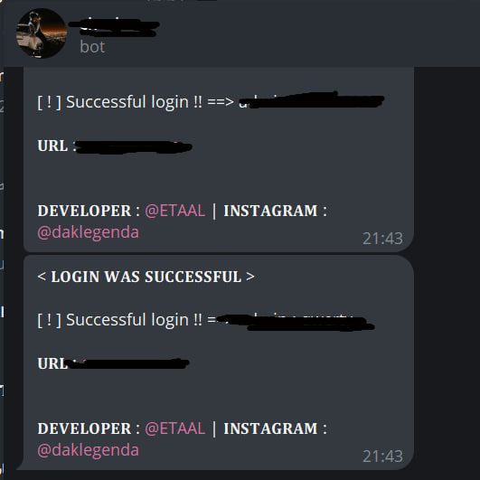

<h3>* If the file does not work for you :</h3>

```python
pip install requests

pip install colorama

pip install os

pip install platform
```


<br>
<h1>Advanced WordPress brute force: </h1>
<div align="center" >

  </div>
<br>

<h3>Edit the info file and set your token and chat ID :</h3>
<div align="center">

</div>
<br>
<hr>

 <P>* Send to Telegram : </P>
 <div align="center">
 
 </div>


